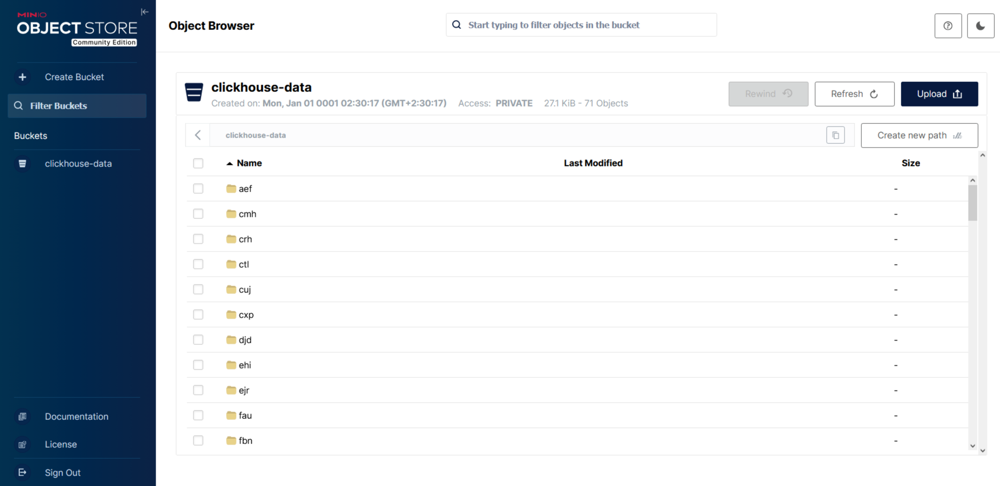

# Разверните S3 с использованием MinIO, Ceph или Object Storage от Yandex Cloud.

```
В docker-compose.yml добавил следующие строки
minio:
    image: minio/minio:latest
    container_name: minio
    hostname: minio
    ports:
      - "9006:9000"
      - "9007:9001"
    environment:
      MINIO_ROOT_USER: minioadmin
      MINIO_ROOT_PASSWORD: minioadmin
    volumes:
      - minio_data:/data
    command: server /data --console-address ":9001"
    restart: unless-stopped
    healthcheck:
      test: [ "CMD", "curl", "-f", "http://localhost:9000/minio/health/live" ]
      interval: 30s
      timeout: 20s
      retries: 3
```

### Создал storage_config.xml

```
<clickhouse>
    <storage_configuration>
        <disks>
            <s3_disk>
                <type>s3</type>
                <endpoint>http://minio:9000/clickhouse-data/</endpoint>
                <access_key_id>minioadmin</access_key_id>
                <secret_access_key>minioadmin</secret_access_key>
                <support_broken_ssl>true</support_broken_ssl>
                <metadata_path>/var/lib/clickhouse/disks/s3_disk/</metadata_path>
            </s3_disk>
        </disks>
        <policies>
            <s3_main>
                <volumes>
                    <main>
                        <disk>s3_disk</disk>
                    </main>
                </volumes>
            </s3_main>
        </policies>
    </storage_configuration>
</clickhouse>

```

### Убедился что контейнер запущен

```
CONTAINER ID   IMAGE                                 COMMAND                  CREATED        STATUS                        PORTS                                                                                      NAMES
22f3b78d870a   clickhouse/clickhouse-server:latest   "/entrypoint.sh"         22 hours ago   Up About a minute             0.0.0.0:8123->8123/tcp, [::]:8123->8123/tcp, 0.0.0.0:9000->9000/tcp, [::]:9000->9000/tcp   clickhouse-01
635946f3cbdb   clickhouse/clickhouse-server:latest   "/entrypoint.sh"         22 hours ago   Up About a minute             0.0.0.0:8128->8123/tcp, [::]:8128->8123/tcp, 0.0.0.0:9005->9000/tcp, [::]:9005->9000/tcp   clickhouse-06
d44900b4c6f4   clickhouse/clickhouse-server:latest   "/entrypoint.sh"         22 hours ago   Up About a minute             0.0.0.0:8125->8123/tcp, [::]:8125->8123/tcp, 0.0.0.0:9002->9000/tcp, [::]:9002->9000/tcp   clickhouse-03
a9e8194e87b2   clickhouse/clickhouse-server:latest   "/entrypoint.sh"         22 hours ago   Up About a minute             0.0.0.0:8127->8123/tcp, [::]:8127->8123/tcp, 0.0.0.0:9004->9000/tcp, [::]:9004->9000/tcp   clickhouse-05
8c63a67e2cb2   clickhouse/clickhouse-server:latest   "/entrypoint.sh"         22 hours ago   Up About a minute             0.0.0.0:8126->8123/tcp, [::]:8126->8123/tcp, 0.0.0.0:9003->9000/tcp, [::]:9003->9000/tcp   clickhouse-04
3a1f6b5023f1   clickhouse/clickhouse-server:latest   "/entrypoint.sh"         22 hours ago   Up About a minute             0.0.0.0:8124->8123/tcp, [::]:8124->8123/tcp, 0.0.0.0:9001->9000/tcp, [::]:9001->9000/tcp   clickhouse-02
58d80f189596   zookeeper:latest                      "/docker-entrypoint.тАж"   22 hours ago   Up About a minute             0.0.0.0:2181->2181/tcp, [::]:2181->2181/tcp                                                zookeeper
e4250192b850   minio/minio:latest                    "/usr/bin/docker-entтАж"   22 hours ago   Up About a minute (healthy)   0.0.0.0:9006->9000/tcp, [::]:9006->9000/tcp, 0.0.0.0:9007->9001/tcp, [::]:9007->9001/tcp   minio
```
### clickhouse-backup был установлен, но возник конфликт конфигурации. Для выполнения задания использован встроенный BACKUP, который работает надежнее.

### Создана тестовая база данных и таблицы

```
clickhouse-01 :) CREATE DATABASE test_db;

CREATE DATABASE test_db

Query id: 57f21c6f-0423-4c6d-aa91-303fcae9287e

Ok.

0 rows in set. Elapsed: 0.004 sec.

clickhouse-01 :) CREATE TABLE test_db.users (id UInt64, name String) ENGINE = MergeTree ORDER BY id SETTINGS storage_policy = 's3_main';

CREATE TABLE test_db.users
(
    `id` UInt64,
    `name` String
)
ENGINE = MergeTree
ORDER BY id
SETTINGS storage_policy = 's3_main'

Query id: e0feea1f-5fd1-4920-9686-33ecf2a7c929

Ok.

0 rows in set. Elapsed: 0.023 sec.

clickhouse-01 :) CREATE TABLE test_db.orders (order_id UInt64, user_id UInt64, amount Float64) ENGINE = MergeTree ORDER BY order_id SETTINGS storage_policy = 's3_main';

CREATE TABLE test_db.orders
(
    `order_id` UInt64,
    `user_id` UInt64,
    `amount` Float64
)
ENGINE = MergeTree
ORDER BY order_id
SETTINGS storage_policy = 's3_main'

Query id: cebc2ed1-6085-41d3-b814-76c9b2d99a5a

Ok.

0 rows in set. Elapsed: 0.020 sec.
```

### Данные вставлены

```
clickhouse-01 :) INSERT INTO test_db.users VALUES (1, 'Alice'), (2, 'Bob'), (3, 'Charlie');

INSERT INTO test_db.users FORMAT Values

Query id: a5d5f4ed-6460-42ca-8e5a-572635f82154

Ok.

3 rows in set. Elapsed: 0.069 sec.

clickhouse-01 :) INSERT INTO test_db.orders VALUES (101, 1, 150.50), (102, 2, 200.00);

INSERT INTO test_db.orders FORMAT Values

Query id: 098fea5d-f2c4-44b5-8d6d-5f770f3727d4

Ok.

2 rows in set. Elapsed: 0.069 sec.

```

### Сделал бэкап

```

clickhouse-01 :) BACKUP DATABASE test_db TO Disk('s3_disk', 'test_db_backup');

BACKUP DATABASE test_db TO Disk('s3_disk', 'test_db_backup')

Query id: 49a39758-dc88-4135-89d2-792d21abf5e5

   ┌─id───────────────────────────────────┬─status─────────┐
1. │ 0f4734ea-2cd7-4008-8332-c22c23e8bcc9 │ BACKUP_CREATED │
   └──────────────────────────────────────┴────────────────┘

1 row in set. Elapsed: 0.048 sec.

```




### Повредил данные

```
clickhouse-01 :) DROP TABLE test_db.users;

DROP TABLE test_db.users

Query id: bf87ebd4-8805-4d65-85a7-c1d621045cb7

Ok.

0 rows in set. Elapsed: 0.002 sec.

clickhouse-01 :) DROP TABLE test_db.orders;

DROP TABLE test_db.orders

Query id: 2c0eaa2b-cbbf-4bf5-818b-44cc6fe3ea64

Ok.

0 rows in set. Elapsed: 0.002 sec.
```

### Восстановил из бэкапа

```
clickhouse-01 :) RESTORE DATABASE test_db FROM Disk('s3_disk', 'test_db_backup');

RESTORE DATABASE test_db FROM Disk('s3_disk', 'test_db_backup')

Query id: 869fdbe3-3d76-495c-a6eb-18c31d7085d7

   ┌─id───────────────────────────────────┬─status───┐
1. │ a5cd55f4-1651-46ab-bb19-f7370956e743 │ RESTORED │
   └──────────────────────────────────────┴──────────┘

1 row in set. Elapsed: 0.078 sec.
```


### Проверил целостность данных

```

clickhouse-01 :) SELECT * FROM test_db.users;

SELECT *
FROM test_db.users

Query id: 4eb349f1-fd77-4ccc-bae0-08b26158074a

   ┌─id─┬─name────┐
1. │  1 │ Alice   │
2. │  2 │ Bob     │
3. │  3 │ Charlie │
   └────┴─────────┘

3 rows in set. Elapsed: 0.019 sec.

clickhouse-01 :) SELECT * FROM test_db.orders;

SELECT *
FROM test_db.orders

Query id: badc181e-27b9-4550-89c6-288d96f93cd8

   ┌─order_id─┬─user_id─┬─amount─┐
1. │      101 │       1 │  150.5 │
2. │      102 │       2 │    200 │
   └──────────┴─────────┴────────┘

2 rows in set. Elapsed: 0.005 sec.


### Убедились что данные восстановлены


