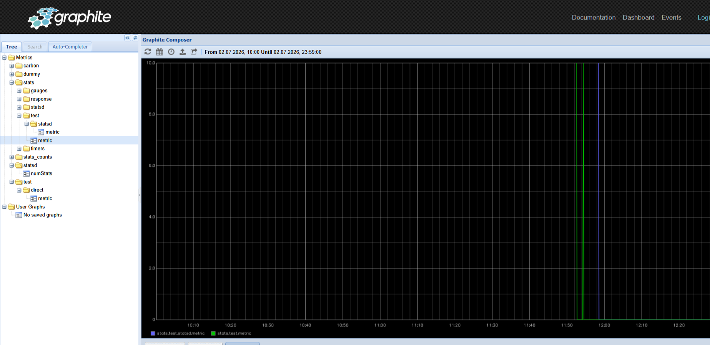
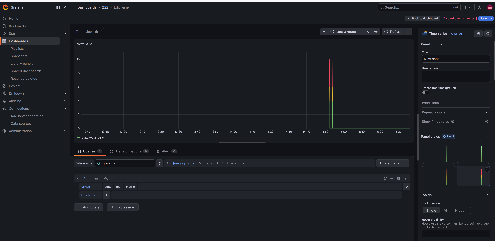

# Развернуте Graphite/Prometheus
### Добавление сервисов мониторинга в docker-compose.yml

```
graphite:
  image: graphiteapp/graphite-statsd:latest
  container_name: graphite
  hostname: graphite
  ports:
    - "8080:8080"          # Graphite Web UI
    - "2003-2004:2003-2004" # Прием метрик
    - "8125:8125/udp"      # StatsD (UDP)
  volumes:
    - graphite_data:/opt/graphite/storage
  environment:
    - STATSD_ENABLED=true
    - STATSD_PORT=8125
    - GRAPHITE_WSGI_PROCESSES=4
    - GRAPHITE_WSGI_THREADS=2
  restart: unless-stopped

graphite_exporter:
  image: prom/graphite-exporter:latest
  container_name: graphite_exporter
  hostname: graphite_exporter
  ports:
    - "9108:9108"          # Prometheus /metrics
    - "9109:9109"          # Graphite plaintext protocol
  volumes:
    - ./graphite_exporter_mapping.yml:/tmp/mapping.yml:ro
  command:
    - '--graphite.mapping-config=/tmp/mapping.yml'
    - '--web.listen-address=:9108'
    - '--graphite.listen-address=:9109'
  restart: unless-stopped

prometheus:
  image: prom/prometheus:latest
  container_name: prometheus
  hostname: prometheus
  ports:
    - "9090:9090"
  volumes:
    - ./prometheus.yml:/etc/prometheus/prometheus.yml:ro
    - prometheus_data:/prometheus
  command:
    - '--config.file=/etc/prometheus/prometheus.yml'
    - '--storage.tsdb.path=/prometheus'
  restart: unless-stopped

node_exporter:
  image: prom/node-exporter:latest
  container_name: node_exporter
  hostname: node_exporter
  ports:
    - "9100:9100"
  volumes:
    - /proc:/host/proc:ro
    - /sys:/host/sys:ro
    - /:/rootfs:ro
  command:
    - '--path.procfs=/host/proc'
    - '--path.sysfs=/host/sys'
    - '--collector.filesystem.mount-points-exclude=^/(sys|proc|dev|host|etc|rootfs/var/lib/docker/containers|rootfs/var/lib/docker/overlay2|rootfs/run/docker/netns|rootfs/var/lib/docker/aufs)($$|/)'
  restart: unless-stopped

grafana:
  image: grafana/grafana:latest
  container_name: grafana
  hostname: grafana
  ports:
    - "80:3000"
  volumes:
    - grafana_data:/var/lib/grafana
  environment:
    - GF_SECURITY_ADMIN_USER=admin
    - GF_SECURITY_ADMIN_PASSWORD=admin
    - GF_INSTALL_PLUGINS=grafana-piechart-panel
  restart: unless-stopped

```

### Создание конфигурационных файлов

```
prometheus.yml
global:
  scrape_interval: 15s
  evaluation_interval: 15s

alerting:
  alertmanagers:
    - static_configs:
        - targets: []

rule_files: []

scrape_configs:
  # Graphite Exporter
  - job_name: 'graphite_exporter'
    static_configs:
      - targets: ['graphite_exporter:9108']

  # Node Exporter
  - job_name: 'node_exporter'
    static_configs:
      - targets: ['node_exporter:9100']

  # ClickHouse метрики
  - job_name: 'clickhouse'
    static_configs:
      - targets: ['clickhouse-01:8123']
    metrics_path: '/metrics'
    params:
      user: ['default']
      password: ['default']

```
graphite_exporter_mapping.yml

```
mappings:
  - match: 'test.*'
    name: 'test_metric'
    labels:
      metric: '$1'

```

### Запуск сервисов

```
docker-compose up -d graphite graphite_exporter prometheus node_exporter grafana

AME                IMAGE                                 COMMAND                  SERVICE             CREATED          STATUS                 PORTS
clickhouse-01       clickhouse/clickhouse-server:latest   "/entrypoint.sh"         clickhouse-01       25 hours ago     Up 4 hours             0.0.0.0:8123->8123/tcp, [::]:8123->8123/tcp, 0.0.0.0:9000->9000/tcp, [::]:9000->9000/tcp
clickhouse-02       clickhouse/clickhouse-server:latest   "/entrypoint.sh"         clickhouse-02       25 hours ago     Up 4 hours             0.0.0.0:8124->8123/tcp, [::]:8124->8123/tcp, 0.0.0.0:9001->9000/tcp, [::]:9001->9000/tcp
clickhouse-03       clickhouse/clickhouse-server:latest   "/entrypoint.sh"         clickhouse-03       25 hours ago     Up 4 hours             0.0.0.0:8125->8123/tcp, [::]:8125->8123/tcp, 0.0.0.0:9002->9000/tcp, [::]:9002->9000/tcp
clickhouse-04       clickhouse/clickhouse-server:latest   "/entrypoint.sh"         clickhouse-04       25 hours ago     Up 4 hours             0.0.0.0:8126->8123/tcp, [::]:8126->8123/tcp, 0.0.0.0:9003->9000/tcp, [::]:9003->9000/tcp
clickhouse-05       clickhouse/clickhouse-server:latest   "/entrypoint.sh"         clickhouse-05       25 hours ago     Up 4 hours             0.0.0.0:8127->8123/tcp, [::]:8127->8123/tcp, 0.0.0.0:9004->9000/tcp, [::]:9004->9000/tcp
clickhouse-06       clickhouse/clickhouse-server:latest   "/entrypoint.sh"         clickhouse-06       25 hours ago     Up 4 hours             0.0.0.0:8128->8123/tcp, [::]:8128->8123/tcp, 0.0.0.0:9005->9000/tcp, [::]:9005->9000/tcp
grafana             grafana/grafana:latest                "/run.sh"                grafana             20 minutes ago   Up 20 minutes          0.0.0.0:80->3000/tcp, [::]:80->3000/tcp
graphite            graphiteapp/graphite-statsd:latest    "/entrypoint"            graphite            33 minutes ago   Up 33 minutes          0.0.0.0:2003-2004->2003-2004/tcp, [::]:2003-2004->2003-2004/tcp, 0.0.0.0:8080->8080/tcp, [::]:8080->8080/tcp, 0.0.0.0:8125->8125/udp, [::]:8125->8125/udp
graphite_exporter   prom/graphite-exporter:latest         "/bin/graphite_exporтАж"   graphite_exporter   46 minutes ago   Up 40 minutes          0.0.0.0:9108-9109->9108-9109/tcp, [::]:9108-9109->9108-9109/tcp
minio               minio/minio:latest                    "/usr/bin/docker-entтАж"   minio               25 hours ago     Up 4 hours (healthy)   0.0.0.0:9006->9000/tcp, [::]:9006->9000/tcp, 0.0.0.0:9007->9001/tcp, [::]:9007->9001/tcp
node_exporter       prom/node-exporter:latest             "/bin/node_exporter тАж"   node_exporter       46 minutes ago   Up 46 minutes          0.0.0.0:9100->9100/tcp, [::]:9100->9100/tcp
prometheus          prom/prometheus:latest                "/bin/prometheus --cтАж"   prometheus          46 minutes ago   Up 40 minutes          0.0.0.0:9090->9090/tcp, [::]:9090->9090/tcp
zookeeper           zookeeper:latest                      "/docker-entrypoint.тАж"   zookeeper           25 hours ago     Up 4 hours             0.0.0.0:2181->2181/tcp, [::]:2181->2181/tcp
                                                                                                                                                                                              
```

### Настройка push-метрик (StatsD → Graphite)
### Отправка метрики в StatsD (UDP)

```
python3 -c "
import socket
sock = socket.socket(socket.AF_INET, socket.SOCK_DGRAM)
sock.sendto(b'test.statsd.metric:100|c', ('localhost', 8125))
sock.close()
print('Metric sent to StatsD')
"
```

### Отправка метрики напрямую в Graphite (TCP)

```
echo "test.direct.metric 100 $(date +%s)" | nc -w1 localhost 2003

```
### Сразу проверим

```
echo "test.exporter.metric 42 $(date +%s)" | nc -w1 localhost 9109

curl -s http://localhost:9108/metrics | grep test.exporter
# HELP test_exporter_metric Graphite metric test_exporter_metric
# TYPE test_exporter_metric gauge
test_exporter_metric 42

                                       

```


### Настройка pull-метрик (Prometheus → graphite_exporter)

```
Проверить, что graphite_exporter собирает метрики
curl -s http://localhost:9108/metrics | grep -E "test|graphite"

```
### Видим результаты теста в graphite




### Создал дашборд в графане
### Результаты тестов в Grafane



