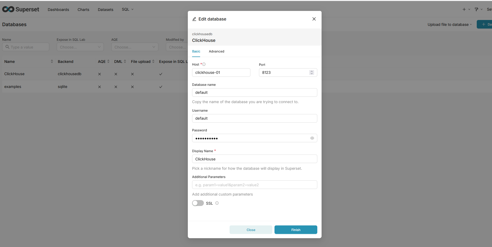

# Разверните и настройте Apache Superset.
### Добавим в docker-compose.yml следующие строки:
```
superset:
    image: apache/superset:latest
    container_name: superset
    hostname: superset
    ports:
      - "8088:8088" 
    environment:
      - SUPERSET_SECRET_KEY=your-secret-key-change-this
    depends_on:
      - clickhouse-01
    volumes:
      - superset_data:/app/superset_home
    restart: unless-stopped

```
### Убедимся что  Apache Superset работает
```
docker ps | grep superset
db29941936f3   apache/superset:latest                "/app/docker/entrypo…"   55 minutes ago   Up 40 minutes (healthy)   0.0.0.0:8088->8088/tcp, [::]:8088->8088/tcp                                                                                                                 superset
```

# Подключите Superset к базе данных ClickHouse


