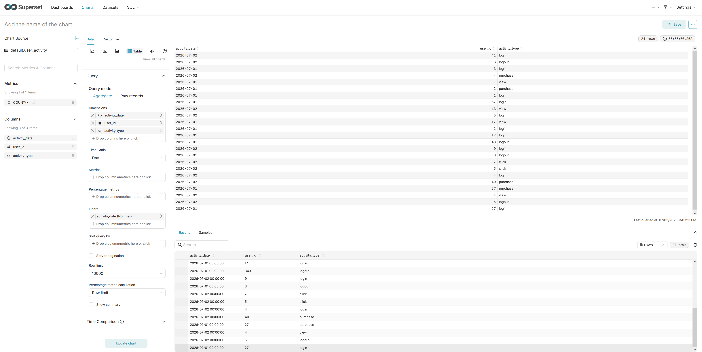

# Разверните и настройте Apache Superset.
### Добавим в docker-compose.yml следующие строки:
```
superset:
    image: apache/superset:latest
    container_name: superset
    hostname: superset
    ports:
      - "8088:8088" 
    environment:
      - SUPERSET_SECRET_KEY=your-secret-key-change-this
    depends_on:
      - clickhouse-01
    volumes:
      - superset_data:/app/superset_home
    restart: unless-stopped

```
### Убедимся что  Apache Superset работает
```
docker ps | grep superset
db29941936f3   apache/superset:latest                "/app/docker/entrypo…"   55 minutes ago   Up 40 minutes (healthy)   0.0.0.0:8088->8088/tcp, [::]:8088->8088/tcp                                                                                                                 superset
```

# Подключите Superset к базе данных ClickHouse


```
clickhouse-01 :) CREATE TABLE user_activity
(
    user_id UInt32,
    activity_type String,
    activity_date DateTime
)
ENGINE = MergeTree
PARTITION BY toYYYYMM(activity_date)
ORDER BY (activity_date, user_id);

CREATE TABLE user_activity
(
    `user_id` UInt32,
    `activity_type` String,
    `activity_date` DateTime
)
ENGINE = MergeTree
PARTITION BY toYYYYMM(activity_date)
ORDER BY (activity_date, user_id)

Query id: eedf4129-d1b6-4dcc-bbf7-f10314f4f4d0

Ok.

0 rows in set. Elapsed: 0.021 sec.

clickhouse-01 :) INSERT INTO user_activity (user_id, activity_type, activity_date) VALUES
(1, 'login', '2026-07-01 08:15:00'),
(1, 'view', '2026-07-01 08:20:00'),
(2, 'login', '2026-07-01 09:00:00'),
(2, 'purchase', '2026-07-01 09:30:00'),
(3, 'login', '2026-07-01 10:00:00'),
(3, 'logout', '2026-07-01 12:00:00'),
(4, 'login', '2026-07-02 14:00:00'),
(4, 'view', '2026-07-02 14:15:00'),
(4, 'purchase', '2026-07-02 14:30:00'),
(5, 'login', '2026-07-02 16:00:00'),
(5, 'click', '2026-07-02 16:05:00'),
(5, 'logout', '2026-07-02 16:30:00');

INSERT INTO user_activity (user_id, activity_type, activity_date) FORMAT Values

Query id: 5d2f14fe-a1e3-40e9-8e18-6c5248864aba

Ok.

12 rows in set. Elapsed: 0.060 sec.

clickhouse-01 :)

```

# Постройте дашборд, включающий пять разных визуализаций на основе данных из ClickHouse


```

clickhouse-01 :)  INSERT INTO user_activity (user_id, activity_type, activity_date) VALUES
(17, 'login', '2026-07-01 08:15:00'),
(17, 'view', '2026-07-01 08:20:00'),
(27, 'login', '2026-07-01 09:00:00'),
(27, 'purchase', '2026-07-01 09:30:00'),
(367, 'login', '2026-07-01 10:00:00'),
(343, 'logout', '2026-07-01 12:00:00'),
(41, 'login', '2026-07-02 14:00:00'),
(43, 'view', '2026-07-02 14:15:00'),
(40, 'purchase', '2026-07-02 14:30:00'),
(9, 'login', '2026-07-02 16:00:00'),
(7, 'click', '2026-07-02 16:05:00'),
(6, 'logout', '2026-07-02 16:31:00');

INSERT INTO user_activity (user_id, activity_type, activity_date) FORMAT Values

Query id: d054ed1c-8a40-4b4c-8975-1b70085c8802

Ok.

12 rows in set. Elapsed: 0.006 sec.

clickhouse-01 :)
```



