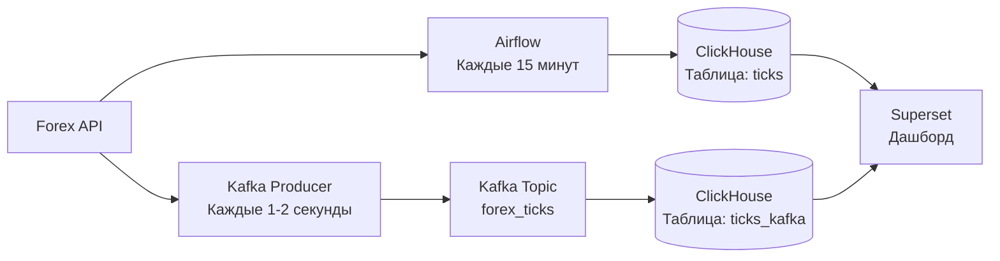

#  Forex Analytics — Система аналитики в реальном времени

##  Описание проекта

Проект представляет собой полноценную платформу для сбора, хранения, обработки и визуализации данных о курсах валют в реальном времени.

**Ключевые компоненты:**

- **ClickHouse** — основное хранилище данных и движок для прогнозирования
- **Apache Airflow** — оркестрация ETL-пайплайнов (пакетная загрузка)
- **Apache Kafka** — потоковая загрузка данных в реальном времени
- **Apache Superset** — визуализация и дашборды

---

##  Архитектура

# Технологический стек проекта

| Компонент | Технология |
|-----------|------------|
| **Хранилище данных** | ClickHouse 26.6.1 |
| **Оркестрация** | Apache Airflow 3.3.0 |
| **Потоковая обработка** | Apache Kafka 7.4.0 |
| **Визуализация** | Apache Superset |
| **Языки программирования** | Python 3.10, SQL |
| **Облачная платформа** | Yandex Cloud |
Облачная платформа	Yandex Cloud

# Что умеет система

## 1. Два подхода к загрузке данных

| Подход | Инструмент | Частота | Таблица |
|--------|------------|---------|---------|
| **Пакетный (Batch)** | Apache Airflow | 15 минут | `ticks` |
| **Потоковый (Streaming)** | Apache Kafka | 1-2 секунды | `ticks_kafka` |

### Особенности реализации

- **Пакетная загрузка** — данные агрегируются и загружаются партиями каждые 15 минут через DAG в Airflow
- **Потоковая загрузка** — данные поступают в реальном времени через Kafka-коннектор и записываются в таблицу `ticks_kafka` с задержкой 1-2 секунды
- Обе таблицы используют движок `MergeTree` для эффективного хранения и индексации
- Данные синхронизированы по временным меткам для возможности сравнения batch и stream подходов

## 2. Прогнозирование

| Параметр | Описание |
|----------|----------|
| **Метод** | Скользящее среднее (Moving Average) на основе последних 10 значений |
| **Реализация** | Материализованные представления в ClickHouse |
| **Обновление** | Автоматическое при поступлении новых данных |

### Детали реализации

- **Алгоритм**: `AVG(value) OVER (ORDER BY time ROWS BETWEEN 9 PRECEDING AND CURRENT ROW)`
- **Период окна**: 10 последних записей
- **Триггер обновления**: Срабатывает автоматически при вставке новых строк в таблицу-источник
- **Хранение**: Результаты сохраняются в материализованном представлении для быстрого доступа
- **Преимущества**:
  - Отсутствие задержек при запросе (данные предрассчитаны)
  - Автоматическая синхронизация с потоковыми данными
  - Минимальная нагрузка на базу данных при чтении
