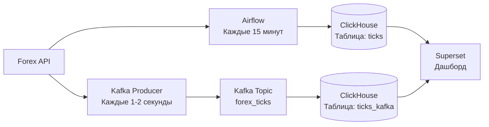

#  Forex Analytics — Система аналитики в реальном времени

##  Описание проекта

Проект представляет собой полноценную платформу для сбора, хранения, обработки и визуализации данных о курсах валют в реальном времени.

**Ключевые компоненты:**

- **ClickHouse** — основное хранилище данных и движок для прогнозирования
- **Apache Airflow** — оркестрация ETL-пайплайнов (пакетная загрузка)
- **Apache Kafka** — потоковая загрузка данных в реальном времени
- **Apache Superset** — визуализация и дашборды

---

##  Архитектура



## Как это работает
```
flowchart LR
    AF[Airflow] --> |Каждые 15 минут| T1[ticks]
    
    K[Kafka Topic<br>forex_ticks] --> Q[kafka_queue]
    Q --> MV[kafka_to_ticks_kafka]
    MV --> T2[ticks_kafka]
    
    T1 --> DB[(ClickHouse)]
    T2 --> DB
```

# Технологический стек проекта

| Компонент | Технология |
|-----------|------------|
| **Хранилище данных** | ClickHouse 26.6.1 |
| **Оркестрация** | Apache Airflow 3.3.0 |
| **Потоковая обработка** | Apache Kafka 7.4.0 |
| **Визуализация** | Apache Superset |
| **Языки программирования** | Python 3.10, SQL |
| **Облачная платформа** | Yandex Cloud |
Облачная платформа	Yandex Cloud

# Что умеет система

## 1. Два подхода к загрузке данных

| Подход | Инструмент | Частота | Таблица |
|--------|------------|---------|---------|
| **Пакетный (Batch)** | Apache Airflow | 15 минут | `ticks` |
| **Потоковый (Streaming)** | Apache Kafka | 1-2 секунды | `ticks_kafka` |

### Особенности реализации

- **Пакетная загрузка** — данные агрегируются и загружаются партиями каждые 15 минут через DAG в Airflow
- **Потоковая загрузка** — данные поступают в реальном времени через Kafka-коннектор и записываются в таблицу `ticks_kafka` с задержкой 1-2 секунды
- Обе таблицы используют движок `MergeTree` для эффективного хранения и индексации
- Данные синхронизированы по временным меткам для возможности сравнения batch и stream подходов

## 2. Прогнозирование

| Параметр | Описание |
|----------|----------|
| **Метод** | Скользящее среднее (Moving Average) на основе последних 10 значений |
| **Реализация** | Материализованные представления в ClickHouse |
| **Обновление** | Автоматическое при поступлении новых данных |

### Детали реализации

- **Алгоритм**: `AVG(value) OVER (ORDER BY time ROWS BETWEEN 9 PRECEDING AND CURRENT ROW)`
- **Период окна**: 10 последних записей
- **Триггер обновления**: Срабатывает автоматически при вставке новых строк в таблицу-источник
- **Хранение**: Результаты сохраняются в материализованном представлении для быстрого доступа
- **Преимущества**:
  - Отсутствие задержек при запросе (данные предрассчитаны)
  - Автоматическая синхронизация с потоковыми данными
  - Минимальная нагрузка на базу данных при чтении

## 3. Дашборд
    Графики курсов для 3 валютных пар


## Требования

Для работы с проектом необходимо наличие следующего окружения:

| Компонент | Описание |
|-----------|----------|
| **Yandex Cloud аккаунт** | Активный аккаунт в облачной платформе Yandex Cloud с доступом к сервисам |
| **SSH-ключи** | Сгенерированная пара ключей (публичный и приватный) для безопасного подключения к виртуальным машинам |
| **yc CLI** | Установленный командный интерфейс Yandex Cloud для управления ресурсами через терминал |

### Проверка установки

```bash
# Проверка наличия yc CLI
yc --version

# Проверка аутентификации в Yandex Cloud
yc config list
```
## Шаги развертывания

```
# 1. Создать ВМ для ClickHouse
yc compute instance create --name clickhouse-01 ...

# 2. Создать ВМ для Airflow
yc compute instance create --name airflow-01 ...

# 3. Создать ВМ для Kafka
yc compute instance create --name kafka-01 ...

# 4. Создать ВМ для Superset
yc compute instance create --name superset-01 ...
```
## Ссылки на работающую систему

| Сервис | Адрес |
|--------|-------|
| **Apache Superset** | [http://**.250.73.***:8088](http://51.250.73.51:8088) |
| **Apache Airflow** | [http://**.88.244.***:8080](http://111.88.244.92:8080) |
| **Kafka UI** | [http://**.77.187.***:8089](http://93.77.187.46:8089) |
| **ClickHouse** |[http://**.160.46.***:8123](http://158.160.46.41:8123) |

### Доступ к сервисам

| Сервис | Назначение |
|--------|------------|
| **Superset** | Визуализация данных и построение дашбордов |
| **Airflow** | Оркестрация и мониторинг DAG-ов |
| **Kafka UI** | Просмотр топиков, мониторинг очередей и управление кластером Kafka |
| **ClickHouse** | Хранилище данных, выполнение SQL-запросов и аналитика |


### Структура репозитория
```
forex-analytics/
├── README.md                 # Главное описание
├── CHANGELOG.md              # История изменений
├── architecture/             # Схемы архитектуры
├── clickhouse/               # SQL-скрипты
│   ├── schema.sql
│   ├── predictions.sql
│   └── metrics.sql
├── airflow/                  # DAG
│   └── forex_dag.py
├── kafka/                    # Producer
│   └── producer.py
├── superset/                 # Экспорт дашборда
│   └── dashboard_export.zip
└── deployment/               # Инструкции
    ├── setup_clickhouse.md
    ├── setup_airflow.md
    ├── setup_kafka.md
    └── setup_superset.md

 ```   
