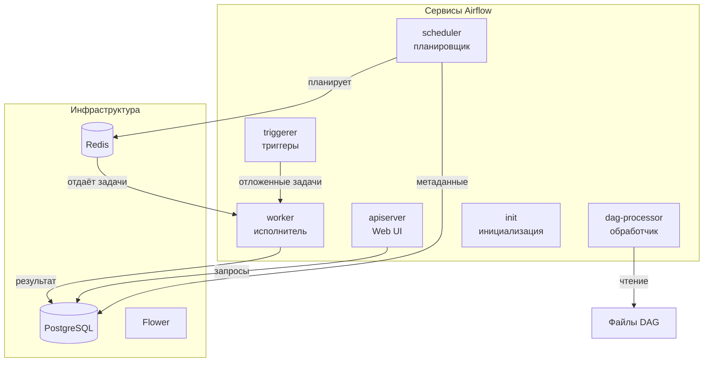
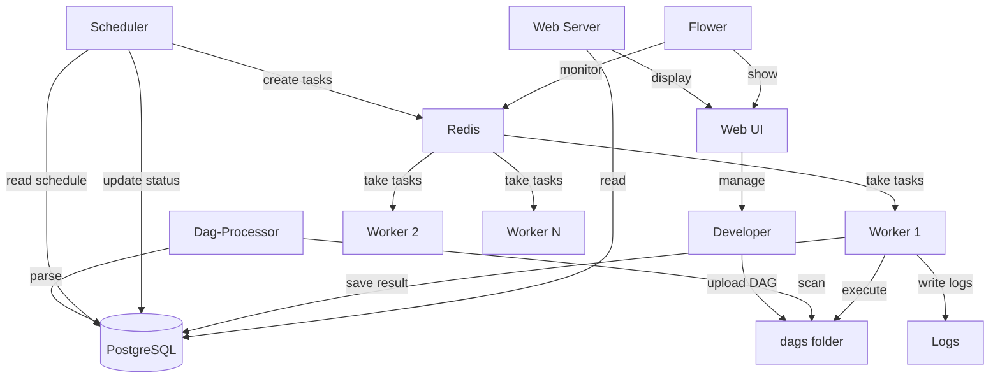

---

## Компоненты Airflow Cluster

### База данных и брокер

| Компонент | Назначение | Описание |
|-----------|------------|----------|
| **PostgreSQL** | База данных | Хранит метаданные DAG, задачи, запуски, переменные |
| **Redis** | Брокер сообщений | Очередь для распределения задач между workers |
| **Flower** | Мониторинг | Веб-интерфейс для отслеживания очередей и worker'ов |

### Сервисы Airflow

| Сервис | Назначение | Роль в кластере |
|--------|------------|-----------------|
| **apiserver (Web UI)** | Веб-интерфейс | Управление DAG, просмотр логов, ручной запуск |
| **scheduler** | Планировщик | Запускает задачи по расписанию, следит за зависимостями |
| **worker** | Исполнитель | Выполняет задачи (операторы) из очереди Redis |
| **dag-processor** | Обработчик | Сканирует папку dags, парсит DAG-файлы |
| **triggerer** | Триггеры | Обрабатывает асинхронные задачи (deferrable operators) |
| **init** | Инициализация | Первичная настройка: создание таблиц, миграции БД |

---

## Схема взаимодействия

