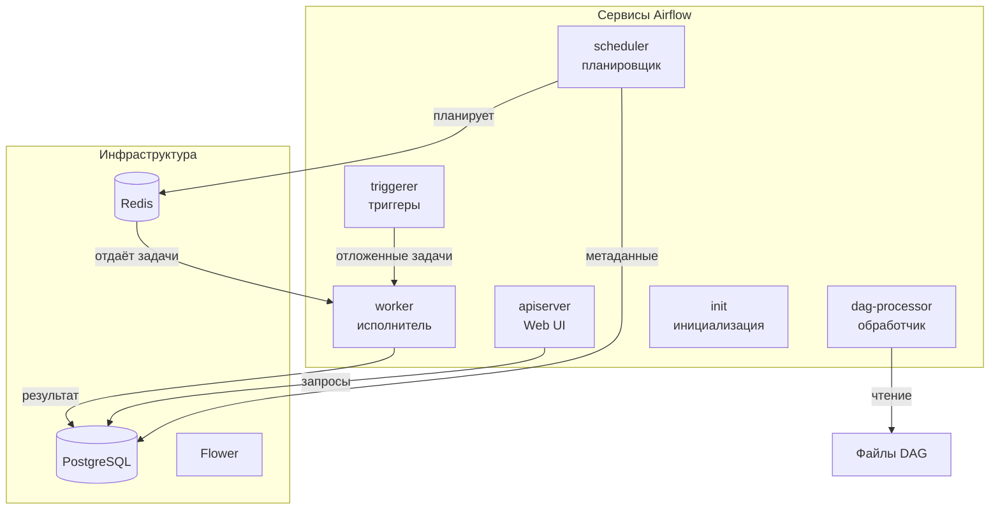

---

## Компоненты Airflow Cluster

### База данных и брокер

| Компонент | Назначение | Описание |
|-----------|------------|----------|
| **PostgreSQL** | База данных | Хранит метаданные DAG, задачи, запуски, переменные |
| **Redis** | Брокер сообщений | Очередь для распределения задач между workers |
| **Flower** | Мониторинг | Веб-интерфейс для отслеживания очередей и worker'ов |

### Сервисы Airflow

| Сервис | Назначение | Роль в кластере |
|--------|------------|-----------------|
| **apiserver (Web UI)** | Веб-интерфейс | Управление DAG, просмотр логов, ручной запуск |
| **scheduler** | Планировщик | Запускает задачи по расписанию, следит за зависимостями |
| **worker** | Исполнитель | Выполняет задачи (операторы) из очереди Redis |
| **dag-processor** | Обработчик | Сканирует папку dags, парсит DAG-файлы |
| **triggerer** | Триггеры | Обрабатывает асинхронные задачи (deferrable operators) |
| **init** | Инициализация | Первичная настройка: создание таблиц, миграции БД |

---

## Схема взаимодействия

graph TD
    subgraph USER[Пользователь]
        DEV[Разработчик]
        UI[Веб-интерфейс]
    end

    subgraph CORE[Ядро Airflow]
        SCH[Scheduler Планировщик]
        PROC[Dag-Processor Обработчик DAG]
        WEB[Web Server API + UI]
    end

    subgraph EXEC[Исполнение]
        REDIS[Redis Очередь задач]
        W1[Worker 1]
        W2[Worker 2]
        W3[Worker N]
    end

    subgraph STORAGE[Хранилище]
        PG[(PostgreSQL Метаданные)]
        DAGS[Папка dags/ .py файлы]
        LOGS[Логи задач]
    end

    subgraph MONITOR[Мониторинг]
        FLOWER[Flower Dashboard]
    end

    DEV -->|1. Загружает DAG| DAGS
    PROC -->|2. Сканирует| DAGS
    PROC -->|3. Парсит| PG
    
    SCH -->|4. Читает расписание| PG
    SCH -->|5. Создаёт задачи| REDIS
    SCH -->|6. Обновляет статус| PG
    
    REDIS -->|7. Забирает задачи| W1
    REDIS -->|7. Забирает задачи| W2
    REDIS -->|7. Забирает задачи| W3
    
    W1 -->|8. Выполняет| DAGS
    W1 -->|9. Пишет логи| LOGS
    W1 -->|10. Сохраняет результат| PG
    
    WEB -->|11. Читает| PG
    WEB -->|12. Отображает| UI
    UI -->|13. Управление| USER
    
    FLOWER -->|14. Мониторит| REDIS
    FLOWER -->|15. Показывает| UI

    style SCH fill:#ff9,stroke:#333,stroke-width:2px
    style REDIS fill:#f9f,stroke:#333,stroke-width:2px
    style PG fill:#9cf,stroke:#333,stroke-width:2px
    style W1 fill:#9f9,stroke:#333,stroke-width:2px
    style W2 fill:#9f9,stroke:#333,stroke-width:2px
    style W3 fill:#9f9,stroke:#333,stroke-width:2px

