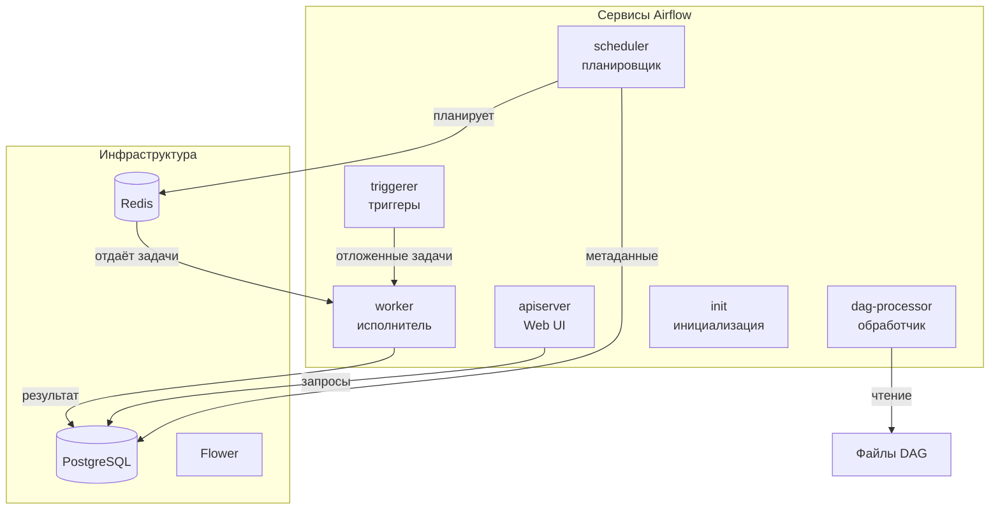
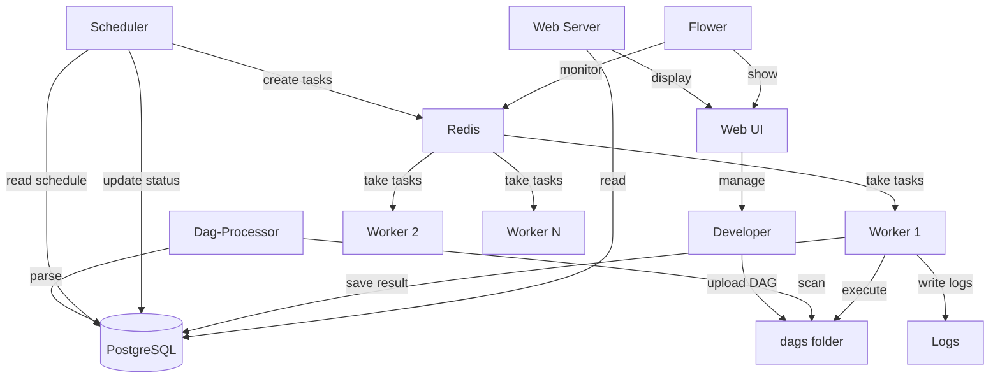

---

## Компоненты Airflow Cluster

### База данных и брокер

| Компонент | Назначение | Описание |
|-----------|------------|----------|
| **PostgreSQL** | База данных | Хранит метаданные DAG, задачи, запуски, переменные |
| **Redis** | Брокер сообщений | Очередь для распределения задач между workers |
| **Flower** | Мониторинг | Веб-интерфейс для отслеживания очередей и worker'ов |

### Сервисы Airflow

| Сервис | Назначение | Роль в кластере |
|--------|------------|-----------------|
| **apiserver (Web UI)** | Веб-интерфейс | Управление DAG, просмотр логов, ручной запуск |
| **scheduler** | Планировщик | Запускает задачи по расписанию, следит за зависимостями |
| **worker** | Исполнитель | Выполняет задачи (операторы) из очереди Redis |
| **dag-processor** | Обработчик | Сканирует папку dags, парсит DAG-файлы |
| **triggerer** | Триггеры | Обрабатывает асинхронные задачи (deferrable operators) |
| **init** | Инициализация | Первичная настройка: создание таблиц, миграции БД |

---

## Схема взаимодействия

1. Разработчик загружает DAG.
2. Dag-Processor парсит его и сохраняет в базу.
3. Scheduler читает расписание и создаёт задачи.
4. Redis хранит очередь задач.
5. Воркеры выполняют задачи и сохраняют результаты.
6. Web Server показывает статус через интерфейс.
7. Flower позволяет мониторить очередь.

Эта архитектура обеспечивает отказоустойчивость, масштабируемость и гибкость — мы можем добавлять воркеры, менять расписание и легко отслеживать состояние системы."

🔄 1. Разработчик и загрузка DAG (30 секунд)

    "Всё начинается с разработчика. Он пишет Python-скрипт — DAG — и загружает его в специальную папку dags. Это файл, в котором описано расписание и шаги загрузки данных."

text

Developer → upload DAG → dags folder

🔍 2. Dag-Processor — обработчик DAG (30 секунд)

    "Dag-Processor — это компонент, который постоянно сканирует папку dags. Когда он находит новый или изменённый файл, он парсит его и сохраняет информацию о DAG в базу данных PostgreSQL. Это нужно, чтобы Scheduler знал, какие задачи и когда запускать."

text

Dag-Processor → scan → dags folder
Dag-Processor → parse → PostgreSQL

📅 3. Scheduler — планировщик (1 минута)

    "Scheduler — это сердце Airflow. Он постоянно читает расписание из базы данных и определяет, какие задачи пора запустить. Когда наступает время, он создаёт задачу и отправляет её в очередь Redis. После выполнения задачи Scheduler обновляет её статус в базе данных."

text

Scheduler → read schedule → PostgreSQL
Scheduler → create tasks → Redis
Scheduler → update status → PostgreSQL

📦 4. Redis — очередь задач (30 секунд)

    "Redis работает как промежуточное хранилище — очередь задач. Scheduler складывает сюда задачи, а воркеры их забирают. Это позволяет нам масштабировать систему: если задач становится много, мы просто добавляем новых воркеров."

text

Redis → take tasks → Worker 1, Worker 2, Worker N

⚙️ 5. Workers — исполнители (1 минута)

    "Воркеры — это те, кто реально выполняет работу. Каждый воркер забирает задачу из Redis, выполняет её (например, загружает данные из API), пишет логи в файл и сохраняет результат в базу данных PostgreSQL. У нас может быть несколько воркеров, работающих параллельно."

text

Worker → execute → dags folder
Worker → write logs → Logs
Worker → save result → PostgreSQL

🌐 6. Web Server — веб-интерфейс (30 секунд)

    "Web Server — это то, что видит пользователь. Он читает информацию о DAG и задачах из базы данных и отображает её в виде веб-интерфейса. Через этот интерфейс пользователь может управлять DAG: запускать, останавливать, смотреть логи."

text

Web Server → read → PostgreSQL
Web Server → display → Web UI

👤 7. Пользователь и управление (30 секунд)

    "Пользователь через веб-интерфейс может управлять DAG — например, запустить задачу вручную, если нужно. Это даёт гибкость и контроль над процессом."

text

Web UI → manage → Developer

📊 8. Flower — мониторинг очереди (30 секунд)

    "Flower — это дополнительный инструмент для мониторинга Redis. Он показывает, сколько задач в очереди, какие воркеры заняты, есть ли ошибки. Это помогает администратору следить за состоянием системы."

text

Flower → monitor → Redis
Flower → show → Web UI

