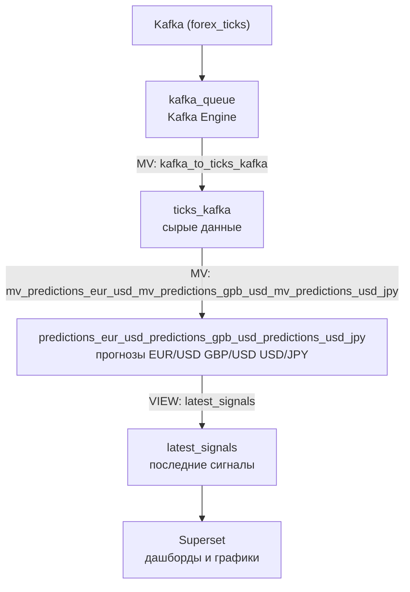

```mermaid
graph TD
    A["Kafka (forex_ticks)"] --> B["kafka_queue<br>Kafka Engine"]
    B -->|"MV: kafka_to_ticks_kafka"| C["ticks_kafka<br>сырые данные"]
    C -->|"MV: mv_predictions_eur_usd_mv_predictions_gpb_usd_mv_predictions_usd_jpy"| D["predictions_eur_usd_predictions_gpb_usd_predictions_usd_jpy<br>прогнозы EUR/USD GBP/USD USD/JPY"]
    D -->|"VIEW: latest_signals"| E["latest_signals<br>последние сигналы"]
    E --> F["Superset<br>дашборды и графики"]
```
