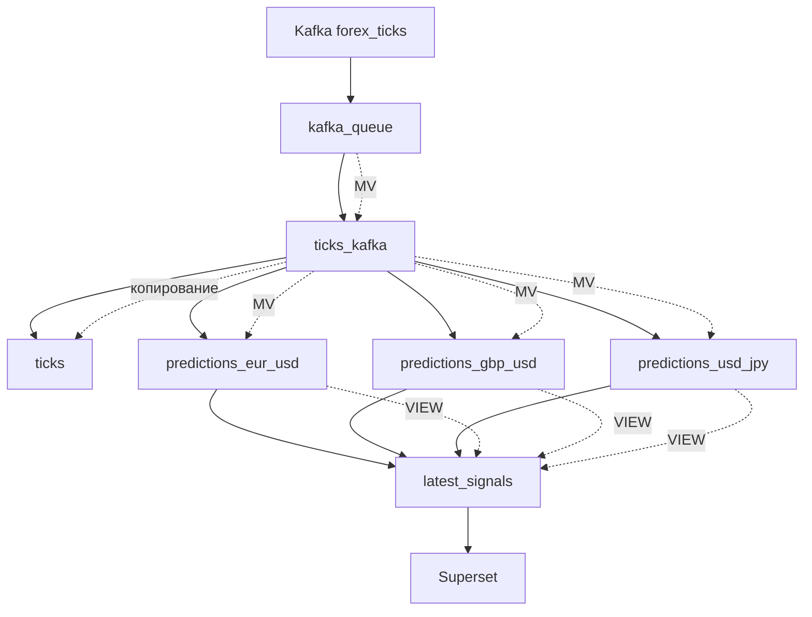

```mermaid
graph TD
    A[Kafka forex_ticks] --> B[kafka_queue]
    B --> C[ticks_kafka]
    C --> D[ticks]
    C --> E[predictions_eur_usd]
    C --> F[predictions_gbp_usd]
    C --> G[predictions_usd_jpy]
    E --> H[latest_signals]
    F --> H
    G --> H
    H --> I[Superset]
    
    B -.->|MV| C
    C -.->|копирование| D
    C -.->|MV| E
    C -.->|MV| F
    C -.->|MV| G
    E -.->|VIEW| H
    F -.->|VIEW| H
    G -.->|VIEW| H
```
