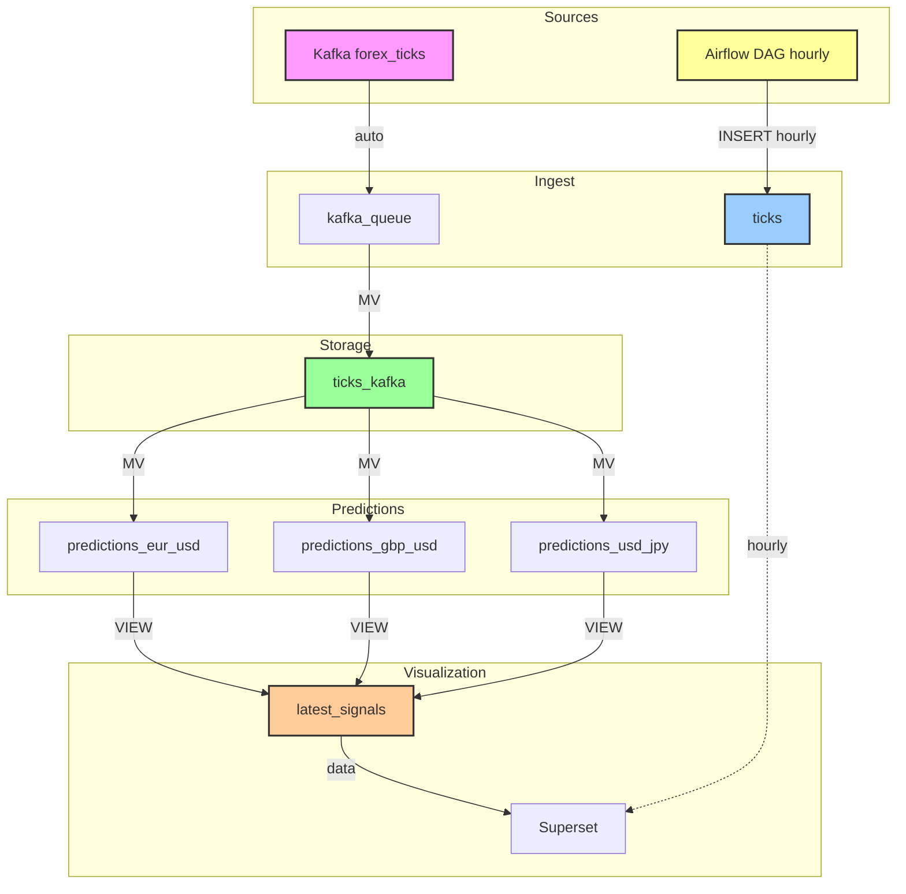

```mermaid
graph TD
    subgraph sources[Sources]
        A[Kafka forex_ticks]
        DAG[Airflow DAG hourly]
    end

    subgraph ingest[Ingest]
        B[kafka_queue]
        T[ticks]
    end

    subgraph storage[Storage]
        C[ticks_kafka]
    end

    subgraph predictions[Predictions]
        E[predictions_eur_usd]
        F[predictions_gbp_usd]
        G[predictions_usd_jpy]
    end

    subgraph visualization[Visualization]
        H[latest_signals]
        I[Superset]
    end

    A -->|auto| B
    B -->|MV| C
    
    DAG -->|INSERT hourly| T
    
    C -->|MV| E
    C -->|MV| F
    C -->|MV| G
    
    E -->|VIEW| H
    F -->|VIEW| H
    G -->|VIEW| H
    
    H -->|data| I
    
    T -.->|hourly| I
   

    style A fill:#f9f,stroke:#333,stroke-width:2px
    style DAG fill:#ff9,stroke:#333,stroke-width:2px
    style C fill:#9f9,stroke:#333,stroke-width:2px
    style T fill:#9cf,stroke:#333,stroke-width:2px
    style H fill:#fc9,stroke:#333,stroke-width:2px
```
