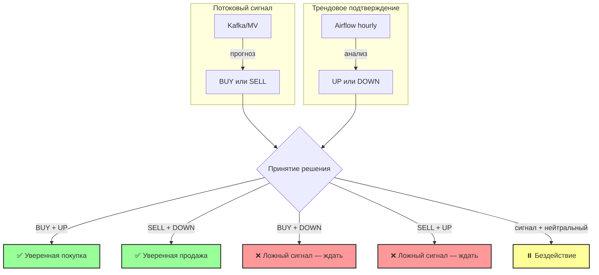

# Бизнес-логика принятия решений

## Два ключевых фактора

| Фактор | Потоковый сигнал (Kafka) | Трендовое подтверждение |
|--------|--------------------------|------------------------|
| **Вопрос** | ⚡ "Куда двигаться прямо сейчас?" | 📊 "В каком направлении рынок?" |
| **Сигнал** | BUY / SELL (мгновенно) | UP / DOWN (за час/день) |
| **Основа** | Прогноз vs текущая цена | Часовой график |
| **Источник** | Kafka / MV | Airflow (hourly) |

---

## Схема принятия решений



# Бизнес-логика принятия решений

## Схема ETL-пайплайна с принятием решений

```mermaid
graph TD
    subgraph SIGNAL[1️⃣ Потоковый сигнал - Kafka]
        A[Kafka forex_ticks] --> B[kafka_queue]
        B -->|MV| C[ticks_kafka]
        C -->|MV| E[predictions_eur_usd]
        E -->|VIEW| H[latest_signals]
        H -->|BUY/SELL| I[Superset]
    end

    subgraph TREND[2️⃣ Трендовое подтверждение - Airflow]
        DAG[Airflow DAG hourly] -->|INSERT| T[ticks]
        T -->|hourly trend| I
    end

    subgraph DECISION[🎯 Принятие решений]
        I -->|Анализ: сигнал + тренд| Decision[Торговое решение]
    end

    style A fill:#f9f,stroke:#333,stroke-width:2px
    style DAG fill:#ff9,stroke:#333,stroke-width:2px
    style C fill:#9f9,stroke:#333,stroke-width:2px
    style T fill:#9cf,stroke:#333,stroke-width:2px
    style H fill:#fc9,stroke:#333,stroke-width:2px
    style Decision fill:#f66,stroke:#333,stroke-width:4px

