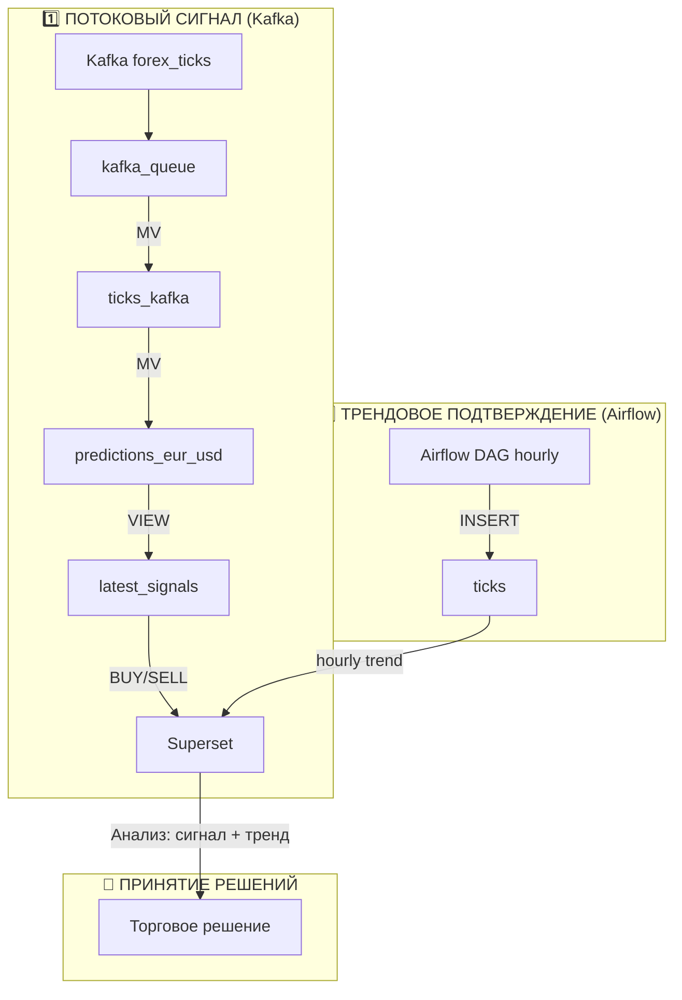

## 🎤 **Доклад по проекту «Гибридный ETL-пайплайн для прогнозирования валютных курсов»**

---

### 1. Вступление

Здравствуйте! Тема моей работы — **разработка гибридного ETL-пайплайна для прогнозирования валютных курсов в реальном времени**.

Ключевая проблема финансовых рынков: данные поступают непрерывно, но для принятия решений нужен не только сигнал «здесь и сейчас», но и понимание общего тренда. Поэтому мы создали систему, которая объединяет **мгновенный сигнал** и **часовое подтверждение**.

Цель — автоматически выдавать торговые рекомендации (покупать/продавать/ждать) с минимальной задержкой, но с максимальной надёжностью.

---

### 2. Архитектура системы

Архитектура построена на двух параллельных каналах обработки данных: **потоковом** и **пакетном**.

### Kafka
Producer — это Python-скрипт, который работает как мост между внешним API и нашей системой.
Он постоянно слушает WebSocket Finnhub и каждое обновление курса отправляет в Kafka. 
Данные передаются в формате CSV, что упрощает их дальнейшую обработку в ClickHouse.
Bid и ask — это две ключевые цены на бирже.
Bid показывает, по какой цене мы можем продать актив, ask — по какой купить. 
Разница между ними называется спредом и является основным источником дохода брокеров.
В скрипте я искусственно создаю bid и ask, чтобы продемонстрировать эту концепцию.
