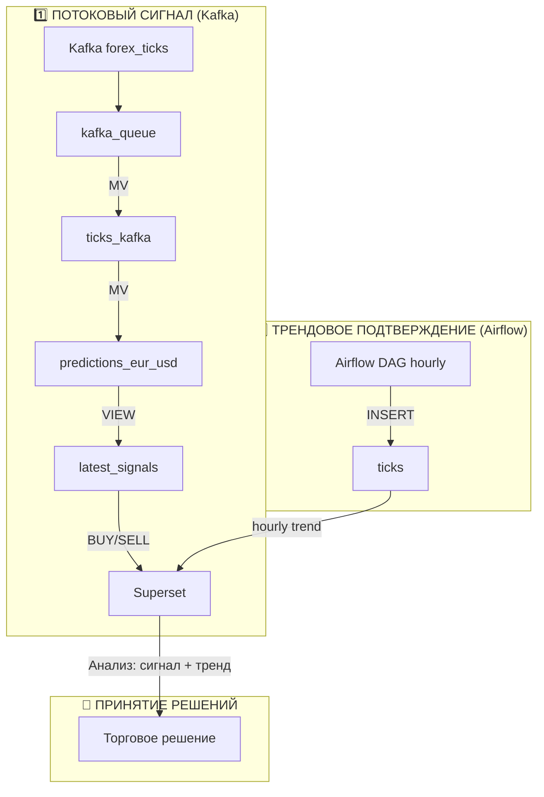

## 🎤 **Доклад по проекту «Гибридный ETL-пайплайн для прогнозирования валютных курсов»**

---

### 1. Вступление

Здравствуйте! Тема моей работы — **разработка гибридного ETL-пайплайна для прогнозирования валютных курсов в реальном времени**.

Ключевая проблема финансовых рынков: данные поступают непрерывно, но для принятия решений нужен не только сигнал «здесь и сейчас», но и понимание общего тренда. Поэтому я создал систему, которая объединяет **мгновенный сигнал** и **часовое подтверждение**.

Цель — автоматически выдавать торговые рекомендации (покупать/продавать/ждать) с минимальной задержкой, но с максимальной надёжностью.

---

### 2. Архитектура системы

Архитектура построена на двух параллельных каналах обработки данных: **потоковом** и **пакетном**.

2.1. Потоковый канал (Kafka) — «Мгновенный сигнал»

Первый канал — потоковый. Данные с биржи поступают в Kafka каждые 2-3 секунды.

Дальше они автоматически загружаются в ClickHouse через Kafka Engine. В ClickHouse мы строим материализованные представления, которые прямо на лету вычисляют скользящее среднее по последним 10 тикам. Это и есть наш прогноз цены.

Сравнивая прогноз с текущей ценой, система генерирует сигнал:
Условие	Сигнал	Значение
actual_price > predicted_price	BUY	Цена ниже прогноза → ожидаем рост
actual_price < predicted_price	SELL	Цена выше прогноза → ожидаем падение
actual_price ≈ predicted_price	HOLD	Разница минимальна → ничего не делаем

Этот сигнал обновляется каждый новый тик и сразу отображается в Superset.
sql

-- Как вычисляется сигнал в VIEW latest_signals
CASE
    WHEN actual_price > predicted_price THEN 'BUY'
    WHEN actual_price < predicted_price THEN 'SELL'
    ELSE 'HOLD'
END AS signal

2.2. Пакетный канал (Airflow) — «Трендовое подтверждение»

Второй канал — пакетный. Раз в час Airflow загружает срез данных из того же API в отдельную таблицу ticks.

На основе этих часовых данных мы строим график тренда — видим, куда рынок двигался за последние сутки: вверх, вниз или боковик.

Это важно, потому что одиночный сигнал может быть ложным. Например, при сильном восходящем тренде даже случайный сигнал SELL часто оказывается ошибочным.

Решение: мы совершаем сделку только когда сигнал совпадает с трендом:
Сигнал (Kafka)	Тренд (Airflow)	Решение	Обоснование
BUY	UP	✅ ПОКУПКА	Сигнал совпадает с трендом
SELL	DOWN	✅ ПРОДАЖА	Сигнал совпадает с трендом
BUY	DOWN	⚠️ ЖДАТЬ	Противоречие: рынок падает
SELL	UP	⚠️ ЖДАТЬ	Противоречие: рынок растёт
HOLD	ANY	⏸️ НЕ ТОРГОВАТЬ	Нет чёткого сигнала

### Kafka
Producer — это Python-скрипт, который работает как мост между внешним API и нашей системой.
Он постоянно слушает WebSocket Finnhub и каждое обновление курса отправляет в Kafka. 
Данные передаются в формате CSV, что упрощает их дальнейшую обработку в ClickHouse.
Bid и ask — это две ключевые цены на бирже.
Bid показывает, по какой цене мы можем продать актив, ask — по какой купить. 
Разница между ними называется спредом и является основным источником дохода брокеров.
В скрипте я искусственно создаю bid и ask, чтобы продемонстрировать эту концепцию.
